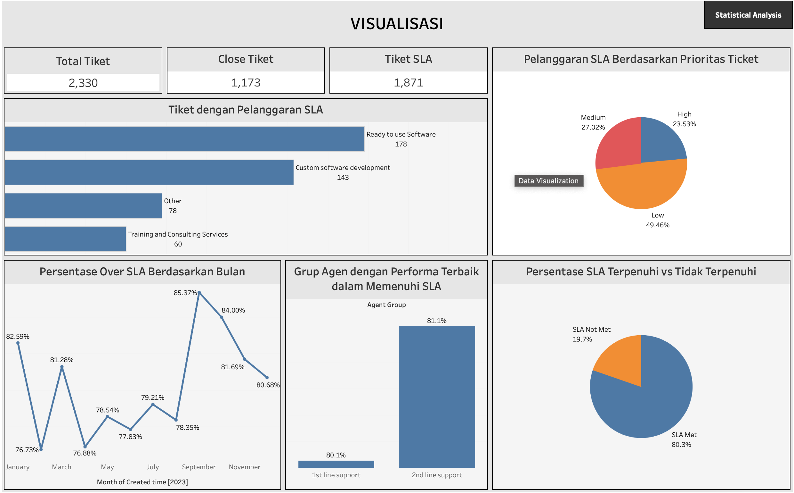

# SLA Compliance Analysis Dashboard

## Project Overview
This project focuses on analyzing SLA (Service Level Agreement) compliance for support tickets. Using statistical analysis and data visualization, it provides insights into response times, resolution efficiency, and SLA adherence rates.

## Key Features
- **Data Analysis**: Cleaning and processing support ticket data.
- **SLA Compliance Metrics**: Evaluating response and resolution times.
- **Visualization**: Interactive dashboard created with [Tableau](https://public.tableau.com/app/profile/yasmine.setiadi/viz/Milestone1_17345206744000/Dashboard1).
- **Technology Stack**:
  - Python (for data preprocessing and analysis)
  - Pandas, NumPy, Matplotlib, Seaborn
  - Gradio (for interactive UI)
  - Kibana Elastic (for additional data visualization & exploration)

## Dataset
- `technical_support_dataset.csv`
- `technical_support_dataset_clean.csv`

## How to Run the Analysis
1. Clone this repository:
   ```bash
   git clone https://github.com/yourusername/SLA-Compliance-Analysis.git
   cd SLA-Compliance-Analysis
   ```
2. Install dependencies:
   ```bash
   pip install -r requirements.txt
   ```
3. Run the data processing script:
   ```bash
   python data_analysis.py
   ```
4. Open the Tableau dashboard [here](https://public.tableau.com/app/profile/yasmine.setiadi/viz/SLAComplianceAnalysisDashboard/Dashboard1#1)

## Dashboard Preview


## Contact
For any inquiries, reach out via [LinkedIn](https://www.linkedin.com/in/yasminenaraindas-setiadi/) or email at ysmnaraindas.work@gmail.com.

---
⭐ Don't forget to star this repository if you found it useful!

